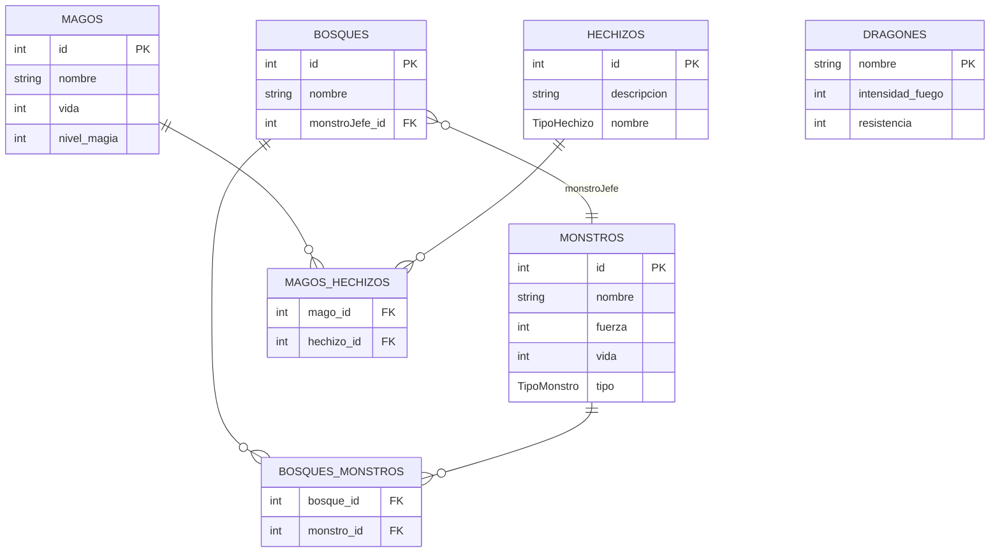
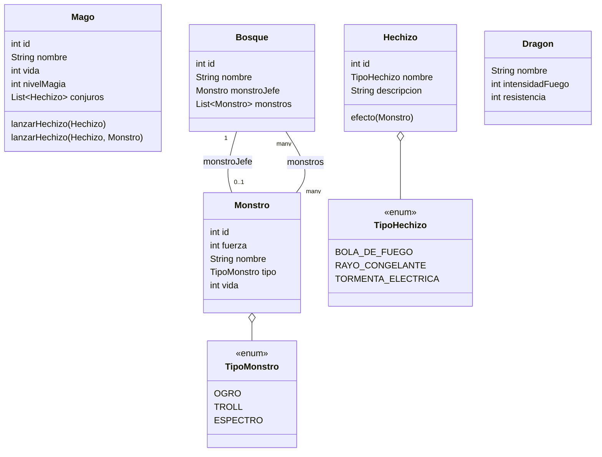

#  Dragonlandia
## Introducción

Un juego muy simplón de dragones y hechizos.

## Analisis
El análsis de dragolandia

## Diseño
### Diagrama de Entidad relación

```mermaid
erDiagram
    MAGOS {
        int id PK
        string nombre
        int vida
        int nivel_magia
    }
    HECHIZOS {
        int id PK
        string descripcion
        TipoHechizo nombre
    }
    MONSTROS {
        int id PK
        string nombre
        int fuerza
        int vida
        TipoMonstro tipo
    }
    BOSQUES {
        int id PK
        string nombre
        int monstroJefe_id FK
    }
    DRAGONES {
        string nombre PK
        int intensidad_fuego
        int resistencia
    }
    MAGOS_HECHIZOS {
        int mago_id FK
        int hechizo_id FK
    }
    BOSQUES_MONSTROS {
        int bosque_id FK
        int monstro_id FK
    }

    MAGOS ||--o{ MAGOS_HECHIZOS : ""
    HECHIZOS ||--o{ MAGOS_HECHIZOS : ""
    BOSQUES ||--o{ BOSQUES_MONSTROS : ""
    MONSTROS ||--o{ BOSQUES_MONSTROS : ""
    BOSQUES }o--|| MONSTROS : "monstroJefe"
```
### Diagrama de clase

```mermaid
classDiagram
    class Mago {
        int id
        String nombre
        int vida
        int nivelMagia
        List~Hechizo~ conjuros
        lanzarHechizo(Hechizo)
        lanzarHechizo(Hechizo, Monstro)
    }
    class Hechizo {
        int id
        TipoHechizo nombre
        String descripcion
        efecto(Monstro)
    }
    class Monstro {
        int id
        int fuerza
        String nombre
        TipoMonstro tipo
        int vida
    }
    class Bosque {
        int id
        String nombre
        Monstro monstroJefe
        List~Monstro~ monstros
    }
    class Dragon {
        String nombre
        int intensidadFuego
        int resistencia
    }
    class TipoHechizo {
        <<enum>>
        BOLA_DE_FUEGO
        RAYO_CONGELANTE
        TORMENTA_ELECTRICA
    }
    class TipoMonstro {
        <<enum>>
        OGRO
        TROLL
        ESPECTRO
    }

    Bosque "1" -- "0..1" Monstro : monstroJefe
    Bosque "many" -- "many" Monstro : monstros
    Hechizo o-- TipoHechizo
    Monstro o-- TipoMonstro
```
