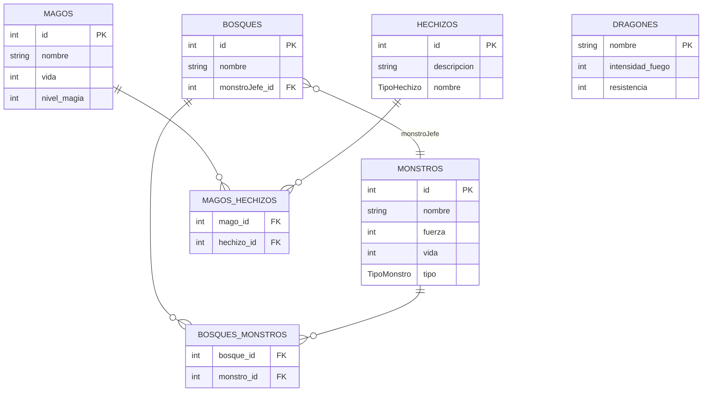
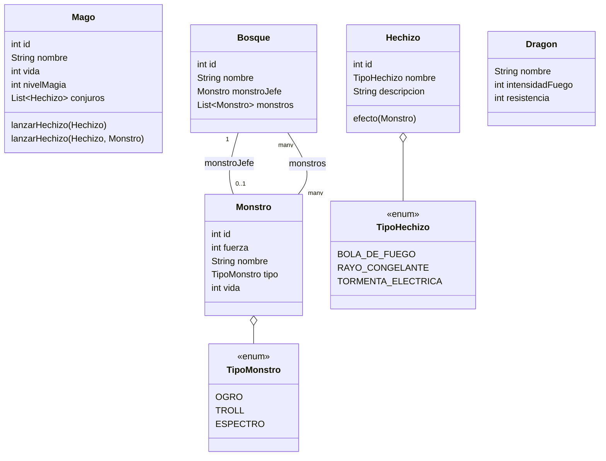
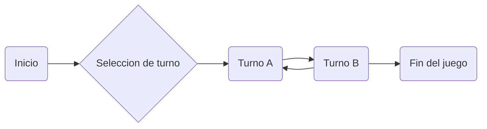

#  Dragonlandia
## Introducción

Un juego muy simplón de dragones y hechizos.

## Analisis
El análsis de dragolandia

## Diseño
### Diagrama de Entidad relación

### Diagrama de clase

## Ampliaciones y Mejoras.

Inicialmente para ampliar el juego y mejorarlo se debe de replantear enteramente el flujo del programa, teniendo en cuenta que un ORM no es la herramienta mas adecuada para la gestión de un juego. 

### Patrones a implementar

Uno de los primeros patrones a implementar es el [patrón de diseño de estado](https://refactoring.guru/design-patterns/state). Un patrón de diseño que permitirá manejar el estado del juego. Un sencillo diagrama explicativo:

De esta manera se puede controlar bien el estado del juego y se evita comportamiento indefinido. Además de que habilita la posiblidad de expansión a otros tipos de estados. 

### Jerarquia y abstracción

Deberia de abstraerse las clases `Monstro`, `Dragon` y `Mago` a una superclase con atributos comunes e interfaces requeridas.